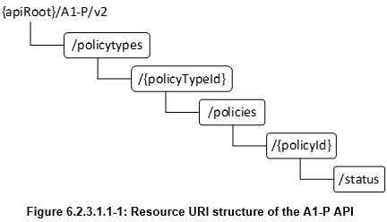

Standalone A1 Mediator for FlexRIC
======== 

The A1 Mediator component listens for policy type and policy instance requests sent via HTTP (the "northbound" interface for rApp or RIC TaaP Studio) and stores those policies for xApps which can request them (the "southbound" interface).

Orange Innovation Poland interpretation of A1 Mediator
----------------
Inspired by Kubernetes-based GO code from [o-ran-sc/ric-plt-a1](https://github.com/o-ran-sc/ric-plt-a1.git), we made a standalone Python-based version using FastAPI library that can be run outside a Kubernetes cluster. <br>

We implemented a few A1 methods that allow [RIC TaaP](https://github.com/Orange-OpenSource/ns-O-RAN-flexric/) FlexRIC testing with Non-RT RIC.<br> The A1 API is compliant with O-RAN.WG2.A1AP-R004-v04.03 but does not fulfill all possible A1 calls.

## Supported API calls
 | **Method** | **Endpoint**                                                | **Description**                |
|------------|-------------------------------------------------------------|--------------------------------|
| GET        | /a1-p/policytypes                                           | List Policy Types          |
| GET        | /a1-p/policytypes/(policy_type_id)                          | Get Policy Type               |
| PUT        | /a1-p/policytypes/(policy_type_id)                         | Create Policy Type            |
| DELETE     | /a1-p/policytypes/(policy_type_id)                         | Delete Policy Type            |
| GET        | /a1-p/policytypes/(policy_type_id)/policies                 | List Policy Instances         |
| PUT        | /a1-p/policytypes/(policy_type_id)/policies/(policy_instance_id) | Create Policy Instance        |
| DELETE     | /a1-p/policytypes/(policy_type_id)/policies/(policy_instance_id) | Delete Policy Instance        |
| GET        | /a1-p/policytypes/(policy_type_id)/policies/(policy_instance_id)/status | Get Policy Instance Status    |

Policy Overview
----------------

There are two "object types" associated with a policy: policy types and policy instances.
<br>
Source: O-RAN.WG2.A1AP-R004-v04.03

Policy Types
----------------
Policy types define the name, description, and most importantly the schema of all instances of that type.  
Think of policy types as defining a JSON schema for the messages exchanged between A1 to xApps and rApps.

Policy Instances
----------------
Policy instances are concrete instantiations of a policy type. They give concrete values of a policy.  
There may be many instances of a single type.

How to run tests?
========
## Run A1 Mediator
```
cd A1_Mediator
pip3 install -r requirements.txt
cd app
python3 main.py (tested with Python 3.10.13)
type in browser: (host_ip):9000/docs #to see available APIs
```

## Run test xApp with FlexRIC:
1. Clone custom FlexRIC dev build from here: [FlexRIC](https://gitlab.eurecom.fr/Kociszz/flexric-a1-xapp/-/tree/A1_integration_RIC_TaaP?ref_type=heads)
2. Build FlexRIC following repo instructions
3. Start **RIC**
```
./build/examples/ric/nearRT-RIC
```
4. Run **ns3** simulation with RIC connection
5. Start **xapp_kpm_rc_a1** xApp
```
./build/examples/xApp/c/kpm_rc_A1/xapp_kpm_rc_a1
```
## Example Policy Type:
```json
{
  "name": "es_policy",
  "description": "Simplified - O-RAN standard Energy saving policy",
  "policy_type_id": 10000,
  "create_schema": {
    "$schema": "http://json-schema.org/draft-07/schema#",
    "type": "object",
    "properties": {
      "cellID": {
        "type": "integer",
        "default": 0
      },
      "ES_State": {
        "type": "bool",
        "default": false
      }
    },
    "additionalProperties": false
  }
}
```
Please note that current version of A1 Mediator supports policies that allows only to dynamically define new fields under predefined "properties" object field.
Other existing fields can be modified, but policy schema should not be modified, e.g. adding new objects. API will not allow to modify them.
## Example Policy Instance:
```json
{
  "data": {
    "cellID": 10,
    "ES_State": true
  }
}
```
## Contributors
- Jerzy Jegier, Orange Innovation Poland
- [Kamil Kociszewski](https://www.linkedin.com/in/kociszz/), Orange Innovation Poland, kamil.kociszewski@orange.com
